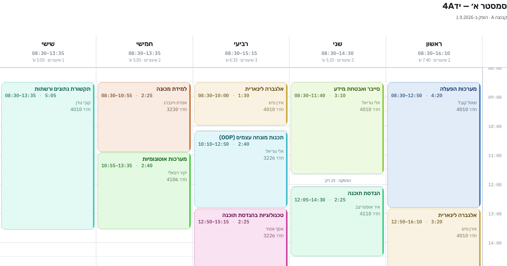

# שעתון

בונה מערכות שעות בעברית. נבנה כי הגיליון של המכללה מציג את שלוש קבוצות הלימוד על אותו לוח ונותן לכל שיעור אותו גודל, מה שהופך אותו לקשה לקריאה מהירה.

**האפליקציה חיה כאן → https://ofeksheskin.github.io/shaaton/**

## מה היא עושה

- **סינון לפי קבוצה** — לכל שיעור מוצמדות הקבוצות שלומדות אותו. לחיצה אחת מעבירה בין A / B / C / הכל. במצב "הכל" שיעורים חופפים נפרסים זה לצד זה.
- **גובה אמיתי** — שיעור של 4:20 גבוה פי ארבעה משיעור של 1:05, במקום שכולם ייראו אותו דבר.
- **עריכה ישירה** — לחיצה על שטח ריק יוצרת שיעור, גרירה מזיזה אותו בין ימים ושעות, גרירת קצה משנה אורך. הכל עם ביטול וחזרה.
- **ארבעה מצבי צביעה** — לפי מקצוע, לפי אורך השיעור, לפי מרצה, לפי סוג.
- **הפסקות מחושבות** — הפערים בין שיעורים מזוהים ומסומנים לבד, לא מוקלדים.
- **זיהוי התנגשויות** — שני שיעורים חופפים באותה קבוצה מסומנים ונספרים.
- **ייצוא** — ICS ליומן גוגל (אירועים שבועיים חוזרים עד סוף הסמסטר), CSV, גיבוי JSON, והדפסה נקייה ל-PDF.
- כמה מערכות במקביל, מצב בהיר וכהה, סיכום שבועי, תצוגת רשימה.

הנתונים נשמרים בדפדפן שלך בלבד ולא נשלחים לשום מקום. כל אחד שפותח את הקישור מקבל את המערכת ההתחלתית ויכול לשנות אותה לעצמו.

## מבנה

| קובץ | מה זה |
|---|---|
| `index.html` | קוד המקור — עמוד אחד, בלי תלויות ובלי שלב בנייה |
| `build.py` | עוטף אותו לעמוד עצמאי ב-`docs/` (מה ש-GitHub Pages מגיש) |
| `docs/` | האתר החי. נוצר אוטומטית — לא לערוך ידנית |

לשינוי: לערוך את `index.html`, להריץ `python3 build.py`, ולדחוף.

---

**In English:** a Hebrew RTL timetable builder for a college schedule that lists three study groups on one sheet. Filters to your own group, sizes each class block by its real duration, computes the breaks, and exports to Google Calendar. One self-contained HTML file, no build step, no dependencies. Data stays in the browser.
